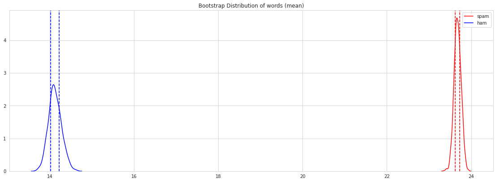

# SMS Spam Classifier

> In this Project, I use Machine Learning Approach to classify SMS Messages in SPAM or in HAM. Where Multinominal Naive Bayes and XGBoost Classifier Model has been used in this Project.

## Attribute Information:

The collection is composed by just one text file, where each line has the correct class followed by the raw message. We offer some examples bellow:

<b>ham</b> What you doing?how are you? <br>
<b>ham</b> Ok lar... Joking wif u oni...<br>
<b>ham</b> dun say so early hor... U c already then say...<br>
<b>ham</b> MY NO. IN LUTON 0125698789 RING ME IF UR AROUND! H*<br>
<b>ham</b> Siva is in hostel aha:-.<br>
<b>ham</b> Cos i was out shopping wif darren jus now n i called him 2 ask wat present he wan lor. Then he started guessing who i was wif n he finally guessed darren lor.<br>

<b>spam</b> FreeMsg: Txt: CALL to No: 86888 & claim your reward of 3 hours talk time to use from your phone now! ubscribe6GBP/ mnth inc 3hrs 16 stop?txtStop<br>
<b>spam</b> Sunshine Quiz! Win a super Sony DVD recorder if you canname the capital of Australia? Text MQUIZ to 82277. B<br>
<b>spam</b> URGENT! Your Mobile No 07808726822 was awarded a L2,000 Bonus Caller Prize on 02/09/03! This is our 2nd attempt to contact YOU! Call 0871-872-9758 BOX95QU<br>

Note: the messages are not chronologically sorted.


```python
import pandas as pd
import seaborn as sns
import matplotlib.pyplot as plt
import numpy as np

import string
from nltk.corpus import stopwords
import nltk
from wordcloud import WordCloud

from scipy.stats import shapiro, mannwhitneyu

from sklearn.feature_extraction.text import CountVectorizer, TfidfTransformer
from sklearn.pipeline import Pipeline
from sklearn.naive_bayes import MultinomialNB
from xgboost import XGBClassifier
from sklearn.model_selection import GridSearchCV, RandomizedSearchCV
from sklearn.model_selection import train_test_split
from sklearn.metrics import confusion_matrix, classification_report
from jcopml.tuning.space import Real, Integer

import warnings
warnings.filterwarnings("ignore")
```


```python
sns.set_style('whitegrid')
```

# Get The Data


```python
spam = pd.read_csv('spam.csv', encoding='latin-1')
spam.shape
```


    (5572, 5)


```python
spam.head()
```


<div>
<style scoped>
    .dataframe tbody tr th:only-of-type {
        vertical-align: middle;
    }

    .dataframe tbody tr th {
        vertical-align: top;
    }

    .dataframe thead th {
        text-align: right;
    }
</style>
<table border="1" class="dataframe">
  <thead>
    <tr style="text-align: right;">
      <th></th>
      <th>v1</th>
      <th>v2</th>
      <th>Unnamed: 2</th>
      <th>Unnamed: 3</th>
      <th>Unnamed: 4</th>
    </tr>
  </thead>
  <tbody>
    <tr>
      <th>0</th>
      <td>ham</td>
      <td>Go until jurong point, crazy.. Available only ...</td>
      <td>NaN</td>
      <td>NaN</td>
      <td>NaN</td>
    </tr>
    <tr>
      <th>1</th>
      <td>ham</td>
      <td>Ok lar... Joking wif u oni...</td>
      <td>NaN</td>
      <td>NaN</td>
      <td>NaN</td>
    </tr>
    <tr>
      <th>2</th>
      <td>spam</td>
      <td>Free entry in 2 a wkly comp to win FA Cup fina...</td>
      <td>NaN</td>
      <td>NaN</td>
      <td>NaN</td>
    </tr>
    <tr>
      <th>3</th>
      <td>ham</td>
      <td>U dun say so early hor... U c already then say...</td>
      <td>NaN</td>
      <td>NaN</td>
      <td>NaN</td>
    </tr>
    <tr>
      <th>4</th>
      <td>ham</td>
      <td>Nah I don't think he goes to usf, he lives aro...</td>
      <td>NaN</td>
      <td>NaN</td>
      <td>NaN</td>
    </tr>
  </tbody>
</table>
</div>


# Drop Unimportant Columns


```python
spam = spam.drop(['Unnamed: 2', 'Unnamed: 3', 'Unnamed: 4'], axis = 1)
spam.shape
```


    (5572, 2)


Drop duplicates messages.


```python
spam.drop_duplicates(inplace = True)
spam.shape
```


    (5169, 2)


Rename columns to make it clear


```python
spam.rename(columns = {'v1' : 'label', 'v2' : 'text'}, inplace = True)
```


```python
spam.describe()
```


<div>
<style scoped>
    .dataframe tbody tr th:only-of-type {
        vertical-align: middle;
    }

    .dataframe tbody tr th {
        vertical-align: top;
    }

    .dataframe thead th {
        text-align: right;
    }
</style>
<table border="1" class="dataframe">
  <thead>
    <tr style="text-align: right;">
      <th></th>
      <th>label</th>
      <th>text</th>
    </tr>
  </thead>
  <tbody>
    <tr>
      <th>count</th>
      <td>5169</td>
      <td>5169</td>
    </tr>
    <tr>
      <th>unique</th>
      <td>2</td>
      <td>5169</td>
    </tr>
    <tr>
      <th>top</th>
      <td>ham</td>
      <td>85233 FREE&gt;Ringtone!Reply REAL</td>
    </tr>
    <tr>
      <th>freq</th>
      <td>4516</td>
      <td>1</td>
    </tr>
  </tbody>
</table>
</div>


```python
spam['label'].value_counts().plot(kind = 'pie', autopct='%1.1f%%')
```


    <matplotlib.axes._subplots.AxesSubplot at 0x7f348f6f94d0>


Well, A dataset can be considered as highly imbalanced. So we need to careful to pick what evaluation metric we'll use. 


```python
spam.isna().sum()
```


    label    0
    text     0
    dtype: int64


Good news! No missing values,

# Exploratory Data Analysis 

In this EDA Part, I want to answer this question: "Is there a significance difference the length and the number of characters between SMS Messages in Spam and SMS Messages in Ham?

## Feature Engineering

To answer the question, we need to engineer our features. We start from the length of the SMS Messages.


```python
spam['length'] = spam['text'].apply(len)
```


```python
fig, axes = plt.subplots(1, 2, figsize = (15,6))

for cat, ax in zip(['spam', 'ham'], axes.flatten()):
    ax.set_title(cat)
    sns.distplot(spam[spam['label'] == cat]['length'], kde = False, color = 'red', ax = ax, bins = [0, 100, 200, 800])
```


```python
fig, axes = plt.subplots(1, 2, figsize = (15,6))

for cat, ax in zip(['spam', 'ham'], axes.flatten()):
    ax.set_title(cat)
    sns.distplot(spam[spam['label'] == cat]['length'], hist = False, color = 'red', ax = ax)
```


```python
plt.figure(figsize = (30,10))
sns.distplot(spam[spam['label'] == 'spam']['length'], color = 'red', label = 'spam')
sns.distplot(spam[spam['label'] == 'ham']['length'], color = 'blue', label = 'ham')
plt.legend()
```


    <matplotlib.legend.Legend at 0x7f348d367d50>


Thats make sense, through simple visualization as above, we discover a trend that spam messages tend to have longer length than ham messages. Well, i think, this is happen cause spam messages, usually is about 'fake' winning lottery messages or fake messages that are considered important. At the same time, ham messages is usualy an instant messages with many slang abbreviation.


```python
spam['words'] = spam['text'].apply(lambda x : len(x.split()))
```


```python
fig, axes = plt.subplots(1, 2, figsize = (15,6))

for cat, ax in zip(['spam', 'ham'], axes.flatten()):
    ax.set_title(cat)
    sns.distplot(spam[spam['label'] == cat]['words'], kde = False, color = 'red', ax = ax)
```


```python
fig, axes = plt.subplots(1, 2, figsize = (15,6))

for cat, ax in zip(['spam', 'ham'], axes.flatten()):
    ax.set_title(cat)
    sns.distplot(spam[spam['label'] == cat]['words'], hist = False, color = 'red', ax = ax)
```


```python
plt.figure(figsize = (30,10))
sns.distplot(spam[spam['label'] == 'spam']['words'], color = 'red', label = 'spam')
sns.distplot(spam[spam['label'] == 'ham']['words'], color = 'blue', label = 'ham')
plt.legend()
```


    <matplotlib.legend.Legend at 0x7f348d0013d0>


As well with number of characters of the messages.

## Statistical Analysis

We'll perfrom Normality Test with Shapiro-Wilk test. 

### Normality Test


```python
shap = []

for i in ['length','words']:
    if shapiro(spam[i])[1] < 0.05:
        shap.append('Reject Null Hypothesis')
    else:
        shap.append('Fail To Reject Null Hypothesis')
        
pd.DataFrame({'Hypothesis' : shap}, index = ['length','words'])
```


<div>
<style scoped>
    .dataframe tbody tr th:only-of-type {
        vertical-align: middle;
    }

    .dataframe tbody tr th {
        vertical-align: top;
    }

    .dataframe thead th {
        text-align: right;
    }
</style>
<table border="1" class="dataframe">
  <thead>
    <tr style="text-align: right;">
      <th></th>
      <th>Hypothesis</th>
    </tr>
  </thead>
  <tbody>
    <tr>
      <th>length</th>
      <td>Reject Null Hypothesis</td>
    </tr>
    <tr>
      <th>words</th>
      <td>Reject Null Hypothesis</td>
    </tr>
  </tbody>
</table>
</div>


As we can see above, all the features we have is non-parametrics data. That's why, if we want to do Significance Test we have to use Mann Whitney U Test. 

### Significance Test

Using MannWhitneyU Test to perform significance Test


```python
mann = []

for i in ['length', 'words']:
    if mannwhitneyu(spam[spam['label'] == 'ham'][i], spam[spam['label'] == 'spam'][i])[1] < 0.05:
        mann.append('Reject Null Hypothesis')
    else:
        mann.append('Fail To Reject Null Hypothesis')

pd.DataFrame({'Hypothesis' : mann}, index = ['length','words'])
```


<div>
<style scoped>
    .dataframe tbody tr th:only-of-type {
        vertical-align: middle;
    }

    .dataframe tbody tr th {
        vertical-align: top;
    }

    .dataframe thead th {
        text-align: right;
    }
</style>
<table border="1" class="dataframe">
  <thead>
    <tr style="text-align: right;">
      <th></th>
      <th>Hypothesis</th>
    </tr>
  </thead>
  <tbody>
    <tr>
      <th>length</th>
      <td>Reject Null Hypothesis</td>
    </tr>
    <tr>
      <th>words</th>
      <td>Reject Null Hypothesis</td>
    </tr>
  </tbody>
</table>
</div>


Interesting! So we can confidence say, that the difference of length and the number of words between Spam messages and ham messages its not by coincidental. 

### Bootstrap distribution

Lets perform bootstrap distribution, to estimate statistics on a population data.


```python
meanLength_spam = []
meanLength_ham = []

for i in range(1000):
    meanLength_spam.append(spam[spam['label'] == 'spam']['length'].sample(len(spam), replace = True).mean())
    meanLength_ham.append(spam[spam['label'] == 'ham']['length']. sample(len(spam), replace = True).mean())
    
lowerLength_spam = np.percentile(meanLength_spam, 25)
upperLength_spam = np.percentile(meanLength_spam, 75)
lowerLength_ham = np.percentile(meanLength_ham, 25)
upperLength_ham = np.percentile(meanLength_ham, 75)

fig = plt.figure(figsize = (15,5))
ax = fig.add_axes([0,0,1,1])
ax.set_title('Bootstrap Distribution of length (mean)')
ax.axvline(lowerLength_spam, linestyle = '--', color = 'red')
ax.axvline(upperLength_spam, linestyle = '--', color = 'red')
ax.axvline(lowerLength_ham, linestyle = '--', color = 'blue')
ax.axvline(upperLength_ham, linestyle = '--', color = 'blue')

sns.distplot(meanLength_spam, ax = ax, hist = False, color = 'red', label = 'spam')
sns.distplot(meanLength_ham, ax = ax, hist = False, color = 'blue', label = 'ham')
plt.legend()
```


    <matplotlib.legend.Legend at 0x7f8ba5de83d0>


```python
meanwords_spam = []
meanwords_ham = []

for i in range(1000):
    meanwords_spam.append(spam[spam['label'] == 'spam']['words'].sample(len(spam), replace = True).mean())
    meanwords_ham.append(spam[spam['label'] == 'ham']['words']. sample(len(spam), replace = True).mean())
    
lowerwords_spam = np.percentile(meanwords_spam, 25)
upperwords_spam = np.percentile(meanwords_spam, 75)
lowerwords_ham = np.percentile(meanwords_ham, 25)
upperwords_ham = np.percentile(meanwords_ham, 75)

fig = plt.figure(figsize = (15,5))
ax = fig.add_axes([0,0,1,1])
ax.set_title('Bootstrap Distribution of words (mean)')
ax.axvline(lowerwords_spam, linestyle = '--', color = 'red')
ax.axvline(upperwords_spam, linestyle = '--', color = 'red')
ax.axvline(lowerwords_ham, linestyle = '--', color = 'blue')
ax.axvline(upperwords_ham, linestyle = '--', color = 'blue')

sns.distplot(meanwords_spam, ax = ax, hist = False, color = 'red', label = 'spam')
sns.distplot(meanwords_ham, ax = ax, hist = False, color = 'blue', label = 'ham')
plt.legend()
```


    <matplotlib.legend.Legend at 0x7f8ba5d08a10>





I think, we got a same result as the exploration data above. 

## WordCloud

At last, I want to know, what words are often appear in ham or spam messages. So we need to visualize it, using WordCloud.


```python
hamWords = ''
spamWords = ''

for i in spam[spam['label'] == 'spam'].text:
    text = i.lower()
    tokens = nltk.word_tokenize(text)
    for words in tokens:
        spamWords += words + ' '
        
for i in spam[spam['label'] == 'ham'].text:
    text = i.lower()
    tokens = nltk.word_tokenize(text)
    for words in tokens:
        hamWords += words + ' '
```


```python
spamWordsCloud = WordCloud(max_font_size=100, max_words=100, width=500, height=300, background_color = 'white').generate(spamWords)
hamWordsCloud = WordCloud(max_font_size=100, max_words=100, width=500, height=300, background_color = 'white').generate(hamWords)
```


```python
plt.figure(figsize=(8,8))
plt.imshow(spamWordsCloud)
plt.axis("off")
plt.tight_layout()
plt.show()
```


As expected, words that many often in the spam messages is <i>free, have won, text, please call, </i> and <i> reply </i>. Like the one who get the messages win lottery or something and feel like an invitation to do something. 


```python
plt.figure(figsize=(8,8))
plt.imshow(hamWordsCloud)
plt.axis("off")
plt.tight_layout()
plt.show()
```


Well, its same as we expected right? Many slang abbreviation.

# Preprocessing Text

To remove the punctuation and stop words.


```python
stopWords = []
for word in stopwords.words('english'):
    s = [char for char in word if char not in string.punctuation]
    stopWords.append(''.join(s))
```


```python
def processing_text(x):
    
    nopunc = [char for char in x if char not in string.punctuation]
    nopunc = ''.join(nopunc)
    
    clean_words = [x for x in nopunc.split() if x.lower() not in stopWords]
    
    return clean_words
```

# Modeling

As i said before, we'll used Multinominal Naive Bayes and XGBoost. 

## Splitting Dataset

1: Spam (positive) <br>
0: Ham (negative)


```python
spam['label'] = spam['label'].map({'spam' : 1, 'ham' : 0})

X = spam['text']
y = spam['label']

X_train, X_test, y_train, y_test = train_test_split(X, y, test_size=0.2, stratify = y)

print(X_train.shape, X_test.shape, y_train.shape, y_test.shape)
```

    (4135,) (1034,) (4135,) (1034,)


## MultinomialNB

### Build the pipeline


```python
NBParams = {
    'nb__alpha' : Real(low=0.3, high=1.3, prior='uniform'),
    'tfidf__use_idf' : [True, False]
}

pipeline = Pipeline([
    ('bow', CountVectorizer(analyzer=processing_text)),  
    ('tfidf', TfidfTransformer()),  
    ('nb', MultinomialNB()),  
])

model = RandomizedSearchCV(pipeline, NBParams, cv = 3, random_state = 101)
model.fit(X_train, y_train)

print(model.best_params_)
```

    {'nb__alpha': 0.37568189764121135, 'tfidf__use_idf': True}


```python
y_pred = model.best_estimator_.predict(X_test)
```

### Evaluation


```python
confusion_matrix(y_test, y_pred)
```


    array([[902,   1],
           [ 22, 109]])


```python
print(classification_report(y_test, y_pred))
```

                  precision    recall  f1-score   support
    
               0       0.98      1.00      0.99       903
               1       0.99      0.83      0.90       131
    
        accuracy                           0.98      1034
       macro avg       0.98      0.92      0.95      1034
    weighted avg       0.98      0.98      0.98      1034
    


That's great, we need to remember, its highly imbalanced dataset. And i want my model have low False Positive numbers. That's why my objective is to have a model with high precision score.

## XGBClassifier


```python
XGBParams = {   
    'xgb__max_depth': Integer(low=3, high=10),
    'xgb__learning_rate': Real(low=-2, high=0, prior='log-uniform'),
    'xgb__n_estimators': Integer(low=150, high=250),
    'xgb__subsample': Real(low=0.3, high=0.7, prior='uniform'),
    'xgb__gamma': Integer(low=1, high=9),
    'xgb__colsample_bytree': Real(low=0.1, high=1, prior='uniform'),
    'xgb__reg_alpha': Real(low=-3, high=1, prior='log-uniform'),
    'xgb__reg_lambda': Real(low=-3, high=1, prior='log-uniform'),
    'tfidf__use_idf' : [True, False]
}
```


```python
pipeline = Pipeline([
    ('bow', CountVectorizer(analyzer=processing_text)),  
    ('tfidf', TfidfTransformer()),  
    ('xgb', XGBClassifier(n_estimators = 200)),  
])

model = RandomizedSearchCV(pipeline, XGBParams, cv = 3, random_state = 101)
model.fit(X_train, y_train)

print(model.best_params_)
```

    {'tfidf__use_idf': False, 'xgb__colsample_bytree': 0.9041206107168668, 'xgb__gamma': 3, 'xgb__learning_rate': 0.1000537631387682, 'xgb__max_depth': 7, 'xgb__n_estimators': 161, 'xgb__reg_alpha': 0.0016264233637290591, 'xgb__reg_lambda': 0.005165444387074998, 'xgb__subsample': 0.4769472526050979}


```python
y_pred = model.best_estimator_.predict(X_test)
```


```python
confusion_matrix(y_test, y_pred)
```


    array([[900,   3],
           [ 36,  95]])


```python
print(classification_report(y_test, y_pred))
```

                  precision    recall  f1-score   support
    
               0       0.96      1.00      0.98       903
               1       0.97      0.73      0.83       131
    
        accuracy                           0.96      1034
       macro avg       0.97      0.86      0.90      1034
    weighted avg       0.96      0.96      0.96      1034
    


if we look again in EDA Part, it is not surprising to see both models working so well in classify the spam messages and ham messages. Even without a model, just use a simple visualization, we can predict where the spam messages and where the ham messages. So, the Multinominal Naive Bayes work better than XGBoost. 

# Sanity Check


```python
NBParams = {
    'nb__alpha' : Real(low=0.3, high=1.3, prior='uniform'),
    'tfidf__use_idf' : [True, False]
}

pipeline = Pipeline([
    ('bow', CountVectorizer(analyzer=processing_text)),  
    ('tfidf', TfidfTransformer()),  
    ('nb', MultinomialNB()),  
])

model = RandomizedSearchCV(pipeline, NBParams, cv = 3, random_state = 101)
model.fit(X_train, y_train)

print(model.best_params_)
```

    {'nb__alpha': 0.37568189764121135, 'tfidf__use_idf': True}


```python
msg = ['Rofl. Its true to its name']
model.best_estimator_.predict(msg), model.best_estimator_.predict_proba(msg)
```


    (array([0]), array([[0.93789044, 0.06210956]]))


```python
msg = ['SIX chances to win CASH! From 100 to 20,000 pounds txt> CSH11 and send to 87575. Cost 150p/day, 6days, 16+ TsandCs apply Reply HL 4 info']
model.best_estimator_.predict(msg), model.best_estimator_.predict_proba(msg)
```


    (array([1]), array([[0.00603373, 0.99396627]]))


I'll try to test our model, using one of the spam messages from this website https://www.adaptivemobile.com/newsroom/press-release/five-top-spam-texts-for-2012-revealed-in-adaptivemobiles-ongoing-threat-ana


```python
msg = ['IMPORTANT - You could be entitled up to £3,160 in compensation from mis-sold PPI on a credit card or loan. Please reply PPI for info or STOP to opt out.']
model.best_estimator_.predict(msg), model.best_estimator_.predict_proba(msg)
```


    (array([1]), array([[0.11874217, 0.88125783]]))


It works well.

# Thank you
