# Context

The dataset used for this notebook is from https://archive.ics.uci.edu/ml/datasets/default+of+credit+card+clients or you can check it in https://www.kaggle.com/uciml/default-of-credit-card-clients-dataset/discussion/34608.

# Attribute Information:

This research employed a binary variable, default payment (Yes = 1, No = 0), as the response variable. This study reviewed the literature and used the following 23 variables as explanatory variables:

* X1: Amount of the given credit (NT dollar): it includes both the individual consumer credit and his/her family (supplementary) credit. <br>
* X2: Gender (1 = male; 2 = female). <br>
* X3: Education (1 = graduate school; 2 = university; 3 = high school; 4 = others). <br>
* X4: Marital status (1 = married; 2 = single; 3 = others). <br>
* X5: Age (year). <br>
* X6 - X11: History of past payment. We tracked the past monthly payment records (from April to September, 2005) as follows: X6 = the repayment status in September, 2005; X7 = the repayment status in August, 2005; . . .;X11 = the repayment status in April, 2005. The measurement scale for the repayment status is: -1 = pay duly; 1 = payment delay for one month; 2 = payment delay for two months; . . .; 8 = payment delay for eight months; 9 = payment delay for nine months and above. <br>
* X12-X17: Amount of bill statement (NT dollar). X12 = amount of bill statement in September, 2005; X13 = amount of bill statement in August, 2005; . . .; X17 = amount of bill statement in April, 2005. <br>
* X18-X23: Amount of previous payment (NT dollar). X18 = amount paid in September, 2005; X19 = amount paid in August, 2005; . . .;X23 = amount paid in April, 2005.

# Importing all packages


```python
import pandas as pd
import numpy as np
import matplotlib.pyplot as plt
import numpy as np
import seaborn as sns

from scipy.stats import shapiro, mannwhitneyu, chi2_contingency
import ppscore as pps

from sklearn.model_selection import train_test_split, RandomizedSearchCV
from sklearn.pipeline import Pipeline
from sklearn.preprocessing import OneHotEncoder
from sklearn.compose import ColumnTransformer
from sklearn.ensemble import AdaBoostClassifier
from sklearn.neighbors import KNeighborsClassifier
from xgboost import XGBClassifier
from sklearn.svm import SVC
from sklearn.metrics import confusion_matrix, f1_score, roc_auc_score, matthews_corrcoef, precision_score, recall_score, accuracy_score

from jcopml.tuning import random_search_params as rsp
from jcopml.tuning.space import Real, Integer

from yellowbrick.model_selection import LearningCurve

import warnings
warnings.filterwarnings("ignore") 
```


```python
sns.set_style('whitegrid')
```


```python
cc = pd.read_csv('UCI_Credit_Card.csv')
cc.shape
```


    (30000, 25)


This dataset contains 30.000 observations with 25 features.


```python
cc.head()
```


<div>
<style scoped>
    .dataframe tbody tr th:only-of-type {
        vertical-align: middle;
    }

    .dataframe tbody tr th {
        vertical-align: top;
    }

    .dataframe thead th {
        text-align: right;
    }
</style>
<table border="1" class="dataframe">
  <thead>
    <tr style="text-align: right;">
      <th></th>
      <th>ID</th>
      <th>LIMIT_BAL</th>
      <th>SEX</th>
      <th>EDUCATION</th>
      <th>MARRIAGE</th>
      <th>AGE</th>
      <th>PAY_0</th>
      <th>PAY_2</th>
      <th>PAY_3</th>
      <th>PAY_4</th>
      <th>...</th>
      <th>BILL_AMT4</th>
      <th>BILL_AMT5</th>
      <th>BILL_AMT6</th>
      <th>PAY_AMT1</th>
      <th>PAY_AMT2</th>
      <th>PAY_AMT3</th>
      <th>PAY_AMT4</th>
      <th>PAY_AMT5</th>
      <th>PAY_AMT6</th>
      <th>default.payment.next.month</th>
    </tr>
  </thead>
  <tbody>
    <tr>
      <th>0</th>
      <td>1</td>
      <td>20000.0</td>
      <td>2</td>
      <td>2</td>
      <td>1</td>
      <td>24</td>
      <td>2</td>
      <td>2</td>
      <td>-1</td>
      <td>-1</td>
      <td>...</td>
      <td>0.0</td>
      <td>0.0</td>
      <td>0.0</td>
      <td>0.0</td>
      <td>689.0</td>
      <td>0.0</td>
      <td>0.0</td>
      <td>0.0</td>
      <td>0.0</td>
      <td>1</td>
    </tr>
    <tr>
      <th>1</th>
      <td>2</td>
      <td>120000.0</td>
      <td>2</td>
      <td>2</td>
      <td>2</td>
      <td>26</td>
      <td>-1</td>
      <td>2</td>
      <td>0</td>
      <td>0</td>
      <td>...</td>
      <td>3272.0</td>
      <td>3455.0</td>
      <td>3261.0</td>
      <td>0.0</td>
      <td>1000.0</td>
      <td>1000.0</td>
      <td>1000.0</td>
      <td>0.0</td>
      <td>2000.0</td>
      <td>1</td>
    </tr>
    <tr>
      <th>2</th>
      <td>3</td>
      <td>90000.0</td>
      <td>2</td>
      <td>2</td>
      <td>2</td>
      <td>34</td>
      <td>0</td>
      <td>0</td>
      <td>0</td>
      <td>0</td>
      <td>...</td>
      <td>14331.0</td>
      <td>14948.0</td>
      <td>15549.0</td>
      <td>1518.0</td>
      <td>1500.0</td>
      <td>1000.0</td>
      <td>1000.0</td>
      <td>1000.0</td>
      <td>5000.0</td>
      <td>0</td>
    </tr>
    <tr>
      <th>3</th>
      <td>4</td>
      <td>50000.0</td>
      <td>2</td>
      <td>2</td>
      <td>1</td>
      <td>37</td>
      <td>0</td>
      <td>0</td>
      <td>0</td>
      <td>0</td>
      <td>...</td>
      <td>28314.0</td>
      <td>28959.0</td>
      <td>29547.0</td>
      <td>2000.0</td>
      <td>2019.0</td>
      <td>1200.0</td>
      <td>1100.0</td>
      <td>1069.0</td>
      <td>1000.0</td>
      <td>0</td>
    </tr>
    <tr>
      <th>4</th>
      <td>5</td>
      <td>50000.0</td>
      <td>1</td>
      <td>2</td>
      <td>1</td>
      <td>57</td>
      <td>-1</td>
      <td>0</td>
      <td>-1</td>
      <td>0</td>
      <td>...</td>
      <td>20940.0</td>
      <td>19146.0</td>
      <td>19131.0</td>
      <td>2000.0</td>
      <td>36681.0</td>
      <td>10000.0</td>
      <td>9000.0</td>
      <td>689.0</td>
      <td>679.0</td>
      <td>0</td>
    </tr>
  </tbody>
</table>
<p>5 rows × 25 columns</p>
</div>


```python
pd.DataFrame({'dataFeatures' : cc.columns, 'dataType' : cc.dtypes.values, 
              'null' : [cc[i].isna().sum() for i in cc.columns],
              'nullPct' : [((cc[i].isna().sum()/len(cc[i]))*100).round(2) for i in cc.columns],
             'Nunique' : [cc[i].nunique() for i in cc.columns],
             'uniqueSample' : [list(pd.Series(cc[i].unique()).sample(2)) for i in cc.columns]}).reset_index(drop = True)
```


<div>
<style scoped>
    .dataframe tbody tr th:only-of-type {
        vertical-align: middle;
    }

    .dataframe tbody tr th {
        vertical-align: top;
    }

    .dataframe thead th {
        text-align: right;
    }
</style>
<table border="1" class="dataframe">
  <thead>
    <tr style="text-align: right;">
      <th></th>
      <th>dataFeatures</th>
      <th>dataType</th>
      <th>null</th>
      <th>nullPct</th>
      <th>Nunique</th>
      <th>uniqueSample</th>
    </tr>
  </thead>
  <tbody>
    <tr>
      <th>0</th>
      <td>ID</td>
      <td>int64</td>
      <td>0</td>
      <td>0.0</td>
      <td>30000</td>
      <td>[24194, 23057]</td>
    </tr>
    <tr>
      <th>1</th>
      <td>LIMIT_BAL</td>
      <td>float64</td>
      <td>0</td>
      <td>0.0</td>
      <td>81</td>
      <td>[40000.0, 110000.0]</td>
    </tr>
    <tr>
      <th>2</th>
      <td>SEX</td>
      <td>int64</td>
      <td>0</td>
      <td>0.0</td>
      <td>2</td>
      <td>[2, 1]</td>
    </tr>
    <tr>
      <th>3</th>
      <td>EDUCATION</td>
      <td>int64</td>
      <td>0</td>
      <td>0.0</td>
      <td>7</td>
      <td>[5, 4]</td>
    </tr>
    <tr>
      <th>4</th>
      <td>MARRIAGE</td>
      <td>int64</td>
      <td>0</td>
      <td>0.0</td>
      <td>4</td>
      <td>[3, 2]</td>
    </tr>
    <tr>
      <th>5</th>
      <td>AGE</td>
      <td>int64</td>
      <td>0</td>
      <td>0.0</td>
      <td>56</td>
      <td>[61, 30]</td>
    </tr>
    <tr>
      <th>6</th>
      <td>PAY_0</td>
      <td>int64</td>
      <td>0</td>
      <td>0.0</td>
      <td>11</td>
      <td>[7, 1]</td>
    </tr>
    <tr>
      <th>7</th>
      <td>PAY_2</td>
      <td>int64</td>
      <td>0</td>
      <td>0.0</td>
      <td>11</td>
      <td>[-1, 5]</td>
    </tr>
    <tr>
      <th>8</th>
      <td>PAY_3</td>
      <td>int64</td>
      <td>0</td>
      <td>0.0</td>
      <td>11</td>
      <td>[8, 2]</td>
    </tr>
    <tr>
      <th>9</th>
      <td>PAY_4</td>
      <td>int64</td>
      <td>0</td>
      <td>0.0</td>
      <td>11</td>
      <td>[6, 0]</td>
    </tr>
    <tr>
      <th>10</th>
      <td>PAY_5</td>
      <td>int64</td>
      <td>0</td>
      <td>0.0</td>
      <td>10</td>
      <td>[-2, 0]</td>
    </tr>
    <tr>
      <th>11</th>
      <td>PAY_6</td>
      <td>int64</td>
      <td>0</td>
      <td>0.0</td>
      <td>10</td>
      <td>[4, 6]</td>
    </tr>
    <tr>
      <th>12</th>
      <td>BILL_AMT1</td>
      <td>float64</td>
      <td>0</td>
      <td>0.0</td>
      <td>22723</td>
      <td>[105105.0, 7065.0]</td>
    </tr>
    <tr>
      <th>13</th>
      <td>BILL_AMT2</td>
      <td>float64</td>
      <td>0</td>
      <td>0.0</td>
      <td>22346</td>
      <td>[7277.0, 94153.0]</td>
    </tr>
    <tr>
      <th>14</th>
      <td>BILL_AMT3</td>
      <td>float64</td>
      <td>0</td>
      <td>0.0</td>
      <td>22026</td>
      <td>[7251.0, 76767.0]</td>
    </tr>
    <tr>
      <th>15</th>
      <td>BILL_AMT4</td>
      <td>float64</td>
      <td>0</td>
      <td>0.0</td>
      <td>21548</td>
      <td>[5733.0, 11950.0]</td>
    </tr>
    <tr>
      <th>16</th>
      <td>BILL_AMT5</td>
      <td>float64</td>
      <td>0</td>
      <td>0.0</td>
      <td>21010</td>
      <td>[45617.0, 41630.0]</td>
    </tr>
    <tr>
      <th>17</th>
      <td>BILL_AMT6</td>
      <td>float64</td>
      <td>0</td>
      <td>0.0</td>
      <td>20604</td>
      <td>[84237.0, 67700.0]</td>
    </tr>
    <tr>
      <th>18</th>
      <td>PAY_AMT1</td>
      <td>float64</td>
      <td>0</td>
      <td>0.0</td>
      <td>7943</td>
      <td>[14180.0, 66.0]</td>
    </tr>
    <tr>
      <th>19</th>
      <td>PAY_AMT2</td>
      <td>float64</td>
      <td>0</td>
      <td>0.0</td>
      <td>7899</td>
      <td>[4070.0, 1450.0]</td>
    </tr>
    <tr>
      <th>20</th>
      <td>PAY_AMT3</td>
      <td>float64</td>
      <td>0</td>
      <td>0.0</td>
      <td>7518</td>
      <td>[15413.0, 179.0]</td>
    </tr>
    <tr>
      <th>21</th>
      <td>PAY_AMT4</td>
      <td>float64</td>
      <td>0</td>
      <td>0.0</td>
      <td>6937</td>
      <td>[6666.0, 8337.0]</td>
    </tr>
    <tr>
      <th>22</th>
      <td>PAY_AMT5</td>
      <td>float64</td>
      <td>0</td>
      <td>0.0</td>
      <td>6897</td>
      <td>[6017.0, 15362.0]</td>
    </tr>
    <tr>
      <th>23</th>
      <td>PAY_AMT6</td>
      <td>float64</td>
      <td>0</td>
      <td>0.0</td>
      <td>6939</td>
      <td>[1691.0, 2056.0]</td>
    </tr>
    <tr>
      <th>24</th>
      <td>default.payment.next.month</td>
      <td>int64</td>
      <td>0</td>
      <td>0.0</td>
      <td>2</td>
      <td>[1, 0]</td>
    </tr>
  </tbody>
</table>
</div>


No missing values! Before I explore the dataset, I'll rename the target column first. 


```python
cc.rename(columns = {'default.payment.next.month' : 'target'}, inplace = True)
```


```python
cc.dtypes
```


    ID             int64
    LIMIT_BAL    float64
    SEX            int64
    EDUCATION      int64
    MARRIAGE       int64
    AGE            int64
    PAY_0          int64
    PAY_2          int64
    PAY_3          int64
    PAY_4          int64
    PAY_5          int64
    PAY_6          int64
    BILL_AMT1    float64
    BILL_AMT2    float64
    BILL_AMT3    float64
    BILL_AMT4    float64
    BILL_AMT5    float64
    BILL_AMT6    float64
    PAY_AMT1     float64
    PAY_AMT2     float64
    PAY_AMT3     float64
    PAY_AMT4     float64
    PAY_AMT5     float64
    PAY_AMT6     float64
    target         int64
    dtype: object


Much better...

# Exploration Data Analysis


```python
cc['target'].value_counts(normalize = True)
```


    0    0.7788
    1    0.2212
    Name: target, dtype: float64


Percentage of default is: 22.12%  

## Hypothesis Testing

Before we go further, i'll do significance test first. But significance test required normality test, to know the data whether normally distribute or not. I'll use shapiro-wilk test to do normality test. 

### Normality Test

It's a little bit tricky, we need to know, what features is numerical or categorical. 


```python
cc.head()
```


<div>
<style scoped>
    .dataframe tbody tr th:only-of-type {
        vertical-align: middle;
    }

    .dataframe tbody tr th {
        vertical-align: top;
    }

    .dataframe thead th {
        text-align: right;
    }
</style>
<table border="1" class="dataframe">
  <thead>
    <tr style="text-align: right;">
      <th></th>
      <th>ID</th>
      <th>LIMIT_BAL</th>
      <th>SEX</th>
      <th>EDUCATION</th>
      <th>MARRIAGE</th>
      <th>AGE</th>
      <th>PAY_0</th>
      <th>PAY_2</th>
      <th>PAY_3</th>
      <th>PAY_4</th>
      <th>...</th>
      <th>BILL_AMT4</th>
      <th>BILL_AMT5</th>
      <th>BILL_AMT6</th>
      <th>PAY_AMT1</th>
      <th>PAY_AMT2</th>
      <th>PAY_AMT3</th>
      <th>PAY_AMT4</th>
      <th>PAY_AMT5</th>
      <th>PAY_AMT6</th>
      <th>target</th>
    </tr>
  </thead>
  <tbody>
    <tr>
      <th>0</th>
      <td>1</td>
      <td>20000.0</td>
      <td>2</td>
      <td>2</td>
      <td>1</td>
      <td>24</td>
      <td>2</td>
      <td>2</td>
      <td>-1</td>
      <td>-1</td>
      <td>...</td>
      <td>0.0</td>
      <td>0.0</td>
      <td>0.0</td>
      <td>0.0</td>
      <td>689.0</td>
      <td>0.0</td>
      <td>0.0</td>
      <td>0.0</td>
      <td>0.0</td>
      <td>1</td>
    </tr>
    <tr>
      <th>1</th>
      <td>2</td>
      <td>120000.0</td>
      <td>2</td>
      <td>2</td>
      <td>2</td>
      <td>26</td>
      <td>-1</td>
      <td>2</td>
      <td>0</td>
      <td>0</td>
      <td>...</td>
      <td>3272.0</td>
      <td>3455.0</td>
      <td>3261.0</td>
      <td>0.0</td>
      <td>1000.0</td>
      <td>1000.0</td>
      <td>1000.0</td>
      <td>0.0</td>
      <td>2000.0</td>
      <td>1</td>
    </tr>
    <tr>
      <th>2</th>
      <td>3</td>
      <td>90000.0</td>
      <td>2</td>
      <td>2</td>
      <td>2</td>
      <td>34</td>
      <td>0</td>
      <td>0</td>
      <td>0</td>
      <td>0</td>
      <td>...</td>
      <td>14331.0</td>
      <td>14948.0</td>
      <td>15549.0</td>
      <td>1518.0</td>
      <td>1500.0</td>
      <td>1000.0</td>
      <td>1000.0</td>
      <td>1000.0</td>
      <td>5000.0</td>
      <td>0</td>
    </tr>
    <tr>
      <th>3</th>
      <td>4</td>
      <td>50000.0</td>
      <td>2</td>
      <td>2</td>
      <td>1</td>
      <td>37</td>
      <td>0</td>
      <td>0</td>
      <td>0</td>
      <td>0</td>
      <td>...</td>
      <td>28314.0</td>
      <td>28959.0</td>
      <td>29547.0</td>
      <td>2000.0</td>
      <td>2019.0</td>
      <td>1200.0</td>
      <td>1100.0</td>
      <td>1069.0</td>
      <td>1000.0</td>
      <td>0</td>
    </tr>
    <tr>
      <th>4</th>
      <td>5</td>
      <td>50000.0</td>
      <td>1</td>
      <td>2</td>
      <td>1</td>
      <td>57</td>
      <td>-1</td>
      <td>0</td>
      <td>-1</td>
      <td>0</td>
      <td>...</td>
      <td>20940.0</td>
      <td>19146.0</td>
      <td>19131.0</td>
      <td>2000.0</td>
      <td>36681.0</td>
      <td>10000.0</td>
      <td>9000.0</td>
      <td>689.0</td>
      <td>679.0</td>
      <td>0</td>
    </tr>
  </tbody>
</table>
<p>5 rows × 25 columns</p>
</div>


```python
numerical = ['LIMIT_BAL', 'AGE', 'BILL_AMT1', 'BILL_AMT2', 'BILL_AMT3',
            'BILL_AMT4', 'BILL_AMT5', 'BILL_AMT6', 'PAY_AMT1', 'PAY_AMT2',
            'PAY_AMT3', 'PAY_AMT4', 'PAY_AMT5', 'PAY_AMT6']
```


```python
shap = []

for i in numerical:
    if shapiro(cc[i])[1] < 0.05:
        shap.append('Reject Null Hypothesis')
    else:
        shap.append('Fail To reject Null Hypothesis')
        
pd.DataFrame({'Hypothesis' : shap}, index = numerical)
```

    /home/user/anaconda3/lib/python3.7/site-packages/scipy/stats/morestats.py:1681: UserWarning: p-value may not be accurate for N > 5000.
      warnings.warn("p-value may not be accurate for N > 5000.")


<div>
<style scoped>
    .dataframe tbody tr th:only-of-type {
        vertical-align: middle;
    }

    .dataframe tbody tr th {
        vertical-align: top;
    }

    .dataframe thead th {
        text-align: right;
    }
</style>
<table border="1" class="dataframe">
  <thead>
    <tr style="text-align: right;">
      <th></th>
      <th>Hypothesis</th>
    </tr>
  </thead>
  <tbody>
    <tr>
      <th>LIMIT_BAL</th>
      <td>Reject Null Hypothesis</td>
    </tr>
    <tr>
      <th>AGE</th>
      <td>Reject Null Hypothesis</td>
    </tr>
    <tr>
      <th>BILL_AMT1</th>
      <td>Reject Null Hypothesis</td>
    </tr>
    <tr>
      <th>BILL_AMT2</th>
      <td>Reject Null Hypothesis</td>
    </tr>
    <tr>
      <th>BILL_AMT3</th>
      <td>Reject Null Hypothesis</td>
    </tr>
    <tr>
      <th>BILL_AMT4</th>
      <td>Reject Null Hypothesis</td>
    </tr>
    <tr>
      <th>BILL_AMT5</th>
      <td>Reject Null Hypothesis</td>
    </tr>
    <tr>
      <th>BILL_AMT6</th>
      <td>Reject Null Hypothesis</td>
    </tr>
    <tr>
      <th>PAY_AMT1</th>
      <td>Reject Null Hypothesis</td>
    </tr>
    <tr>
      <th>PAY_AMT2</th>
      <td>Reject Null Hypothesis</td>
    </tr>
    <tr>
      <th>PAY_AMT3</th>
      <td>Reject Null Hypothesis</td>
    </tr>
    <tr>
      <th>PAY_AMT4</th>
      <td>Reject Null Hypothesis</td>
    </tr>
    <tr>
      <th>PAY_AMT5</th>
      <td>Reject Null Hypothesis</td>
    </tr>
    <tr>
      <th>PAY_AMT6</th>
      <td>Reject Null Hypothesis</td>
    </tr>
  </tbody>
</table>
</div>


### Significance Test

Let's do mannwhitneyu Test then...


```python
mann = []

for i in numerical:
    if mannwhitneyu(cc[cc['target'] == 0][i],cc[cc['target'] == 1][i])[1] < 0.05:
        mann.append('Reject Null Hypothesis')
    else:
        mann.append('Fail To Reject Null Hypothesis')
    
pd.DataFrame(mann, columns = ['Hypothesis'], index = numerical)
```


<div>
<style scoped>
    .dataframe tbody tr th:only-of-type {
        vertical-align: middle;
    }

    .dataframe tbody tr th {
        vertical-align: top;
    }

    .dataframe thead th {
        text-align: right;
    }
</style>
<table border="1" class="dataframe">
  <thead>
    <tr style="text-align: right;">
      <th></th>
      <th>Hypothesis</th>
    </tr>
  </thead>
  <tbody>
    <tr>
      <th>LIMIT_BAL</th>
      <td>Reject Null Hypothesis</td>
    </tr>
    <tr>
      <th>AGE</th>
      <td>Fail To Reject Null Hypothesis</td>
    </tr>
    <tr>
      <th>BILL_AMT1</th>
      <td>Reject Null Hypothesis</td>
    </tr>
    <tr>
      <th>BILL_AMT2</th>
      <td>Reject Null Hypothesis</td>
    </tr>
    <tr>
      <th>BILL_AMT3</th>
      <td>Reject Null Hypothesis</td>
    </tr>
    <tr>
      <th>BILL_AMT4</th>
      <td>Fail To Reject Null Hypothesis</td>
    </tr>
    <tr>
      <th>BILL_AMT5</th>
      <td>Fail To Reject Null Hypothesis</td>
    </tr>
    <tr>
      <th>BILL_AMT6</th>
      <td>Fail To Reject Null Hypothesis</td>
    </tr>
    <tr>
      <th>PAY_AMT1</th>
      <td>Reject Null Hypothesis</td>
    </tr>
    <tr>
      <th>PAY_AMT2</th>
      <td>Reject Null Hypothesis</td>
    </tr>
    <tr>
      <th>PAY_AMT3</th>
      <td>Reject Null Hypothesis</td>
    </tr>
    <tr>
      <th>PAY_AMT4</th>
      <td>Reject Null Hypothesis</td>
    </tr>
    <tr>
      <th>PAY_AMT5</th>
      <td>Reject Null Hypothesis</td>
    </tr>
    <tr>
      <th>PAY_AMT6</th>
      <td>Reject Null Hypothesis</td>
    </tr>
  </tbody>
</table>
</div>


#### Chi2 Test


```python
for i in ['ID', 'target']:
    numerical.append(i)
```


```python
categorical = cc.drop(numerical, axis = 1).columns
```


```python
chi2 = []

for i in categorical:
    if chi2_contingency(pd.crosstab(cc['target'], cc[i]))[1] < 0.05:
        chi2.append('Reject Null Hypothesis')
    else:
        chi2.append('Fail To Reject Null Hypothesis')
        
pd.DataFrame({'Hypothesis' : chi2}, index = categorical)
```


<div>
<style scoped>
    .dataframe tbody tr th:only-of-type {
        vertical-align: middle;
    }

    .dataframe tbody tr th {
        vertical-align: top;
    }

    .dataframe thead th {
        text-align: right;
    }
</style>
<table border="1" class="dataframe">
  <thead>
    <tr style="text-align: right;">
      <th></th>
      <th>Hypothesis</th>
    </tr>
  </thead>
  <tbody>
    <tr>
      <th>SEX</th>
      <td>Reject Null Hypothesis</td>
    </tr>
    <tr>
      <th>EDUCATION</th>
      <td>Reject Null Hypothesis</td>
    </tr>
    <tr>
      <th>MARRIAGE</th>
      <td>Reject Null Hypothesis</td>
    </tr>
    <tr>
      <th>PAY_0</th>
      <td>Reject Null Hypothesis</td>
    </tr>
    <tr>
      <th>PAY_2</th>
      <td>Reject Null Hypothesis</td>
    </tr>
    <tr>
      <th>PAY_3</th>
      <td>Reject Null Hypothesis</td>
    </tr>
    <tr>
      <th>PAY_4</th>
      <td>Reject Null Hypothesis</td>
    </tr>
    <tr>
      <th>PAY_5</th>
      <td>Reject Null Hypothesis</td>
    </tr>
    <tr>
      <th>PAY_6</th>
      <td>Reject Null Hypothesis</td>
    </tr>
  </tbody>
</table>
</div>


From the significance test, we know AGE and amount of bill statement in June, May, and April are not significance (difference). My recommendation, focus on amount of bill statement in September, August, and July.

Wait, AGE is not significance? That's interesting. But why? I thought, younger people will defaulting more. Let's visualize it. 


```python
cc[cc['target'] == 0]['AGE'].plot(kind = 'kde', color = 'blue', label = 'Default Payment = 0')
cc[cc['target'] == 1]['AGE'].plot(kind = 'kde', color = 'red', label = 'Default Payment = 1')
plt.legend()
plt.title('Age distribution')
```


    Text(0.5, 1.0, 'Age distribution')


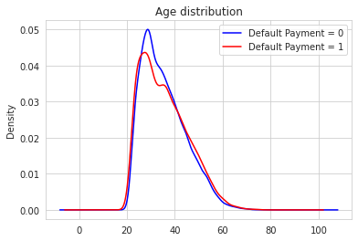


```python
sns.boxplot(y = cc['AGE'], x = cc['target'])
```


    <matplotlib.axes._subplots.AxesSubplot at 0x7f0d46488fd0>


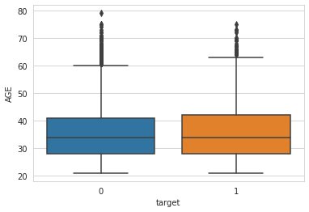


Oh! I see! Almost no difference at all in age distributions between defaulters and not. That's so suprising. Thanks to Significance Test. 


```python
fig, ax = plt.subplots(1, 3, figsize = (20, 7))

for i,j in zip(ax.flatten(), ['BILL_AMT1', 'BILL_AMT2', 'BILL_AMT3']):
    sns.distplot(cc[j], ax = i)
```


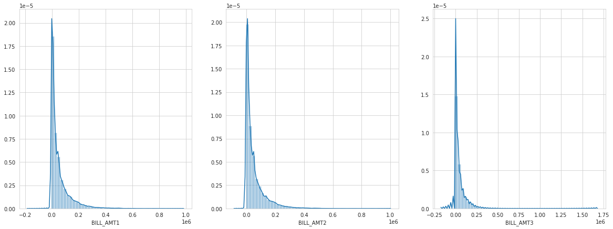


The pattern between amount of bill statement in September, August, and July looks same. And that's make sense, most people don't want have too much debt and the vast majority of people have debt below about NT$ 50.000. How about the limit balanced? Let me guess, I think, people with lower limit balanced are more likely defaulting. Prove me wrong please... 


```python
cc[cc['target'] == 0]['LIMIT_BAL'].plot(kind = 'kde', color = 'blue', label = 'Default Payment = 0')
cc[cc['target'] == 1]['LIMIT_BAL'].plot(kind = 'kde', color = 'red', label = 'Default Payment = 1')
plt.legend()
plt.title('LIMIT_BAL distribution')
```


    Text(0.5, 1.0, 'LIMIT_BAL distribution')


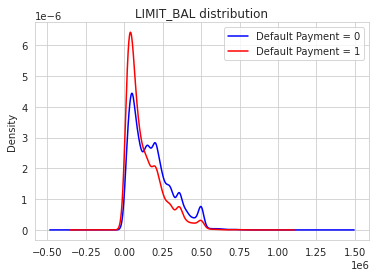


:( it's not suprising at all. The lower limit balanced are more likely defaulting then people with higher limit balanced. Why this make sense? Cause If bank seems 'don't trust' you or they see you're a 'high risk' applicant, bank usually will only give you a smaller line of credit. Does education significance (quantitively)?


```python
plt.figure(figsize = (10, 5))
sns.countplot(cc['EDUCATION'], hue = cc['target'])
plt.xticks((0,1,2,3,4,5,6),('<12 grade','graduate school','university',
                            'high school','other','trade school','Not disclosed'))
plt.tight_layout()
```


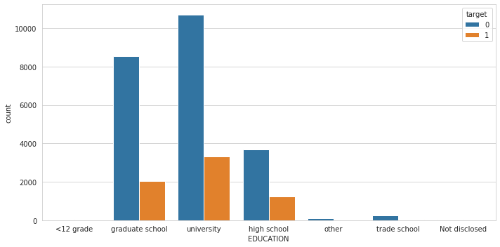


In this observations, our debtors are mostly educated people. Let's do feature selection using Predictive Power Scoring...


```python
plt.figure(figsize = (20, 5))
df_predictors = pps.predictors(cc, y="target")
sns.barplot(data=df_predictors, x="x", y="ppscore")
plt.tight_layout()
```


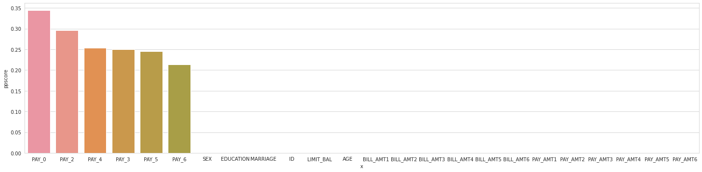


That's interesting, history of payment features will help model to predictive whether the debtors will defaulting or not. 


```python
fig, ax = plt.subplots(2,3, figsize = (20, 8))

for i,j in zip([0,2,3,4,5,6],ax.flatten()):
    sns.countplot(cc['PAY_{}'.format(i)], hue = cc['target'], ax = j)
```


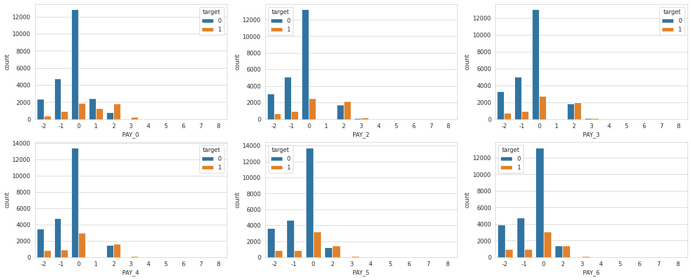


Seems they all look same. This plot tell us, that not everyone pays their debt on time.  But for the debtors that are already late in a few monts, it looks like they're more likely to end up in default than debtors who end up paying off their debt. 

# Splitting Dataset


```python
X = cc.drop(columns = 'target')
y = cc['target']

X_train, X_test, y_train, y_test = train_test_split(X, y, test_size = 0.2, random_state = 101, stratify = y)
X_train.shape, X_test.shape, y_train.shape, y_test.shape
```


    ((24000, 24), (6000, 24), (24000,), (6000,))


# Preprocessing


```python
categorical = Pipeline([
    ('onehot', OneHotEncoder(handle_unknown = 'ignore'))
])

preprocessor = ColumnTransformer([
    ('cat', categorical, ['PAY_{}'.format(i) for i in [0,2,3,4,5,6]])
])
```

# Modeling


```python
def evaluationMetrics(y_test, y_pred):
    f1.append(f1_score(y_test,y_pred))
    prec.append(precision_score(y_test, y_pred))
    recall.append(recall_score(y_test, y_pred))
    auc.append(roc_auc_score(y_test, y_pred))
    acc.append(accuracy_score(y_test, y_pred))
    matthews.append(matthews_corrcoef(y_test, y_pred))
```


```python
metric = pd.DataFrame(index = ['AdaBoost Classifier', 'KNN Classifier', 'XGBoost Classifier']) 
f1 = []
prec = []
recall = []
matthews = []
auc = []
acc = []
```

## Adaboost


```python
ada_params = {
    'algo__learning_rate': Real(low=-2, high=0, prior='log-uniform'),
    'algo__n_estimators': Integer(low=100, high=200)
}
```


```python
pipeline = Pipeline([
    ('prep', preprocessor),
    ('algo', AdaBoostClassifier())
])

ada = RandomizedSearchCV(pipeline, ada_params, cv = 3, n_jobs = -1, random_state = 101)
ada.fit(X_train, y_train)

print(ada.best_params_)
print(ada.score(X_train, y_train), ada.best_score_, ada.score(X_test, y_test))
```

    {'algo__learning_rate': 0.36122336008063605, 'algo__n_estimators': 105}
    0.8197083333333334 0.8192083333333334 0.8256666666666667


```python
y_pred_ada = ada.best_estimator_.predict(X_test)
evaluationMetrics(y_test, y_pred_ada)
```

## KNN


```python
knn_params = {
    'algo__n_neighbors': Integer(low=1, high=20),
}
```


```python
pipeline = Pipeline([
    ('prep', preprocessor),
    ('algo', KNeighborsClassifier())
])

knn = RandomizedSearchCV(pipeline, knn_params, cv = 3, n_jobs = -1, random_state = 101)
knn.fit(X_train, y_train)

print(knn.best_params_)
print(knn.score(X_train, y_train), knn.best_score_, knn.score(X_test, y_test))
```

    {'algo__n_neighbors': 16}
    0.8184166666666667 0.8162916666666667 0.8191666666666667


```python
y_pred_knn = knn.best_estimator_.predict(X_test)
evaluationMetrics(y_test, y_pred_knn)
```

## XGBoost Classifier


```python
pipeline = Pipeline([
    ('prep', preprocessor),
    ('algo', XGBClassifier())
])

xgb = RandomizedSearchCV(pipeline, rsp.xgb_params, cv = 3, n_jobs = -1, random_state = 101)
xgb.fit(X_train, y_train)

print(xgb.best_params_)
print(xgb.score(X_train, y_train), xgb.best_score_, xgb.score(X_test, y_test))
```

    {'algo__colsample_bytree': 0.14363608368376052, 'algo__gamma': 8, 'algo__learning_rate': 0.4501489968769524, 'algo__max_depth': 9, 'algo__n_estimators': 162, 'algo__reg_alpha': 0.2573510611415207, 'algo__reg_lambda': 0.23179283837105844, 'algo__subsample': 0.5208429341570253}
    0.821125 0.8199166666666667 0.8258333333333333


```python
y_pred_xgb = xgb.best_estimator_.predict(X_test)
evaluationMetrics(y_test, y_pred_xgb)
```

# Evaluation

## Metrics


```python
metric['F1'] = f1
metric['Precision'] = prec
metric['Recall'] = recall
metric['MCC'] = matthews
metric['AUC'] = auc
metric['accuracy'] = acc
```


```python
metric
```


<div>
<style scoped>
    .dataframe tbody tr th:only-of-type {
        vertical-align: middle;
    }

    .dataframe tbody tr th {
        vertical-align: top;
    }

    .dataframe thead th {
        text-align: right;
    }
</style>
<table border="1" class="dataframe">
  <thead>
    <tr style="text-align: right;">
      <th></th>
      <th>F1</th>
      <th>Precision</th>
      <th>Recall</th>
      <th>MCC</th>
      <th>AUC</th>
      <th>accuracy</th>
    </tr>
  </thead>
  <tbody>
    <tr>
      <th>AdaBoost Classifier</th>
      <td>0.485236</td>
      <td>0.699291</td>
      <td>0.371515</td>
      <td>0.420359</td>
      <td>0.663074</td>
      <td>0.825667</td>
    </tr>
    <tr>
      <th>KNN Classifier</th>
      <td>0.440433</td>
      <td>0.697712</td>
      <td>0.321778</td>
      <td>0.386976</td>
      <td>0.641095</td>
      <td>0.819167</td>
    </tr>
    <tr>
      <th>XGBoost Classifier</th>
      <td>0.490989</td>
      <td>0.694215</td>
      <td>0.379804</td>
      <td>0.422884</td>
      <td>0.666149</td>
      <td>0.825833</td>
    </tr>
  </tbody>
</table>
</div>


## Confusion Matrix

### Adaboost


```python
sns.heatmap(confusion_matrix(y_test, y_pred_ada), annot = True)
```


    <matplotlib.axes._subplots.AxesSubplot at 0x7f0d341d8c50>


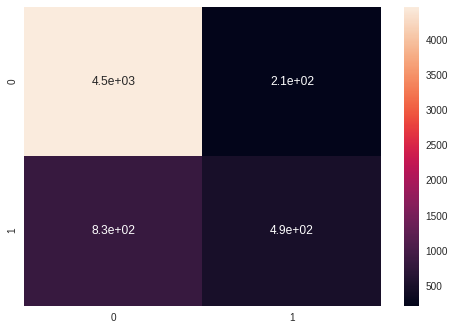


### KNN


```python
sns.heatmap(confusion_matrix(y_test, y_pred_knn), annot = True)
```


    <matplotlib.axes._subplots.AxesSubplot at 0x7f0d34202fd0>


### XGBoost


```python
sns.heatmap(confusion_matrix(y_test, y_pred_xgb), annot = True)
```


    <matplotlib.axes._subplots.AxesSubplot at 0x7f0d342ade90>


## Learning Curves

### Adaboost


```python
sizes = np.linspace(0.3, 1, 10)

visualizer = LearningCurve(
    ada.best_estimator_, scoring = 'accuracy', train_size = sizes, random_state = 101,  cv = 3
)

visualizer.fit(X_train, y_train)
visualizer.show()
```


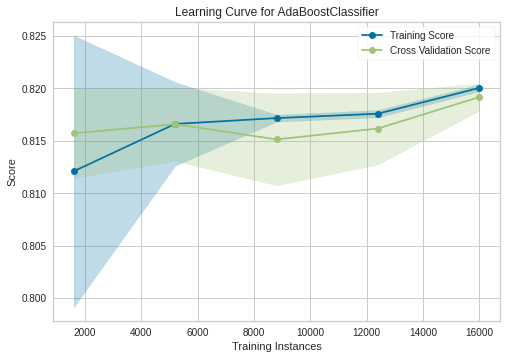


    <matplotlib.axes._subplots.AxesSubplot at 0x7f0d3440df90>


### KNN


```python
sizes = np.linspace(0.3, 1, 10)

visualizer = LearningCurve(
    knn.best_estimator_, scoring = 'accuracy', train_size = sizes, random_state = 101,  cv = 3
)

visualizer.fit(X_train, y_train)
visualizer.show()
```


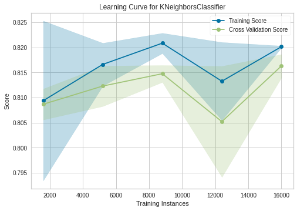


    <matplotlib.axes._subplots.AxesSubplot at 0x7f0d343f6790>


### XGBoost


```python
sizes = np.linspace(0.3, 1, 10)

visualizer = LearningCurve(
    xgb.best_estimator_, scoring = 'accuracy', train_size = sizes, random_state = 101,  cv = 3
)

visualizer.fit(X_train, y_train)
visualizer.show()
```


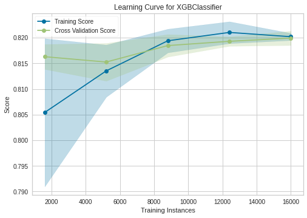


    <matplotlib.axes._subplots.AxesSubplot at 0x7f0d342f7c50>


# Conclusion

Our best model is XGBoost with 82-83% accuracy and if we see to his learning curve, its a good fit.

# Thank you
